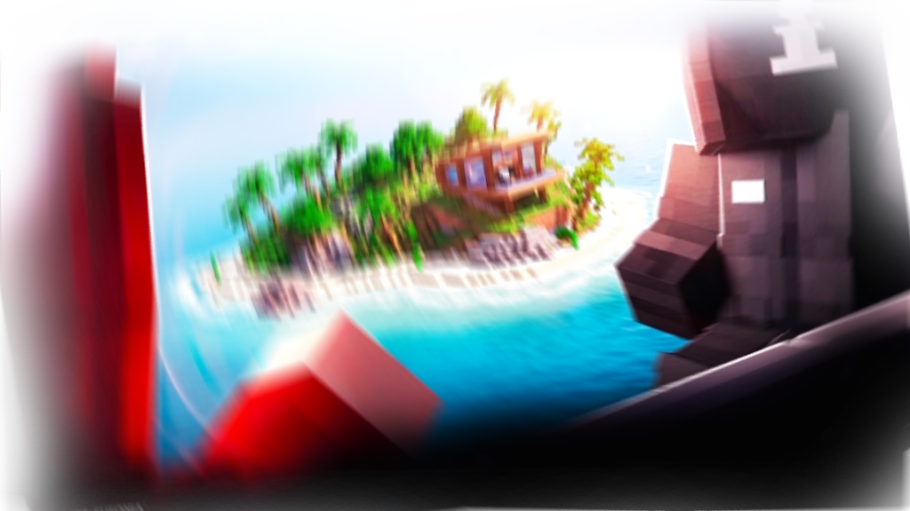
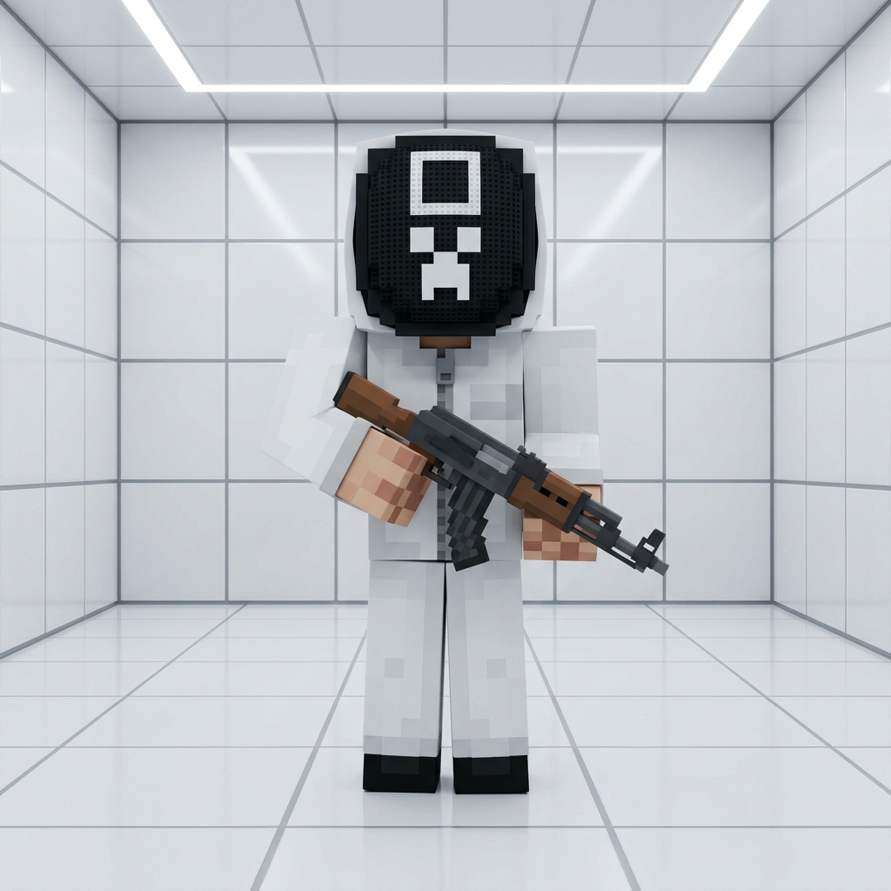

<p align="center">
  <a href="https://mrblour.github.io/Flutcom/" target="_blank">
    
  </a>
</p>

<h1 align="center">
  🌐 Infinity Studios
</h1>

<p align="center">
  <strong>Sitio Web Oficial & Plataforma Interactiva de Infinity Studios</strong>
  <br/>
  Construido con el motor <strong>Flutcom SPA Micro-Framework</strong> para una experiencia ultrarrápida, fluida y sin recargas de página.
  <br/><br/>
</p>

<div align="center">

[
[](#)
[](https://github.com/Mrblour/Flutcom)
[](#)
[](#)

</div>

---

> [!TIP]
> 🚀 **¡Explora el Live Demo en Vivo!**
> Puedes interactuar directamente con la plataforma en línea visitando la [Demo oficial en GitHub Pages](https://mrblour.github.io/infinity-web-bautic/).

---

## 🌟 Sobre Infinity Studios & Tecnología Flutcom

**Infinity Studios** es una agencia creativa y plataforma digital enfocada en la creación de experiencias web, eventos masivos para creadores de contenido (como *Hunt and Run* y *Squid Craft Games*) y producciones digitales.

Para garantizar el máximo rendimiento y una experiencia de usuario instantánea, esta web está impulsada por **Flutcom**, un micro-framework SPA (Single Page Application) moderno basado en JavaScript nativo:

* **Sin recarga de página**: Navegación fluida por hash routing administrada por el motor `Flutcom`.
* **Cero librerías pesadas**: Diseñado para cargar en milisegundos con rendimiento 100/100.
* **Componentes Modulares**: Separación limpia entre vistas, parciales y componentes dinámicos.

---

## 📸 Galería & Vista Previa Visual

<table align="center">
  <tr>
    <td width="50%" align="center">
      
      <br />
      <sub><b>Eventos & Proyectos</b></sub>
    </td>
    <td width="50%" align="center">
      
      <br />
      <sub><b>Experiencias Interactivas</b></sub>
    </td>
  </tr>
</table>

---

## ✨ Características Principales

| Característica | Descripción |
| :--- | :--- |
| ⚡ **Motor SPA Flutcom** | Sistema de ruteo cliente ultrarrápido sin peticiones pesadas al servidor en cada cambio de vista. |
| 🎨 **Estilo Premium & Dark Mode** | Interfaz moderna con efectos de cristal (*glassmorphic UI*), degradados fluidos y acentos en verde neón (`#89F336`). |
| 🧩 **Arquitectura Modular HTML** | Estructura organizada en `views/`, `partials/` (Header, Footer) y `components/` (Roadmap, Creadores, Features). |
| 💨 **Tailwind CSS v4 Integration** | Compilación automatizada en tiempo real mediante `npm run dev`. |
| 📱 **100% Responsive & Adaptable** | Adaptado a dispositivos móviles, tablets y monitores de alta resolución con menú lateral fluido. |
| 💬 **Sistema de Modales Interactivos** | Integración nativa de modales dinámicos como el cuadro de diálogo de la comunidad de **Discord**. |

---

## 📁 Estructura del Proyecto

```text
infinity/
├── 📁 assets/                    # Archivos estáticos del sitio
│   ├── 📁 css/                   # Estilos personalizados (style.css, flutcom.css)
│   ├── 📁 img/                   # Logos, banners de eventos y capturas
│   └── 📁 vendor/tailwind/       # Estilos compilados de Tailwind CSS v4
├── 📁 flutcom/                   # Motor Core de ruteo y ciclo de vida de Flutcom
├── 📁 plugins/                   # Módulos interactivos (Modales, Menú Móvil, Carrusel)
├── 📁 resources/                 # Componentes y Vistas HTML
│   ├── 📁 components/            # Componentes reutilizables (Roadmap, Creadores)
│   ├── 📁 partials/              # Cabecera (Header) y Pie de página (Footer)
│   └── 📁 views/                 # Páginas principales (Home, Proyectos, Nosotros, Games)
├── 📁 run/                       # Scripts de ejecución del entorno local (dev.js)
├── 📁 src/                       # Entrada de Tailwind CSS (input.css)
├── 📄 flutcom.config.js          # Configuración principal de rutas, plugins y metadatos
├── 📄 index.html                 # Punto de entrada HTML principal (App Shell)
└── 📄 package.json               # Configuración de dependencias y scripts npm
```

---

## 🛠️ Requisitos e Instalación

### Requisitos Previos

Asegúrate de contar con **Node.js** (v18 o superior) instalado en tu equipo:
- [Descargar Node.js LTS](https://nodejs.org)

Verifica la instalación en tu terminal:
```bash
node -v
npm -v
```

### Guía de Inicio Rápido

1. **Clona el repositorio**:
   ```bash
   git clone https://github.com/TU_USUARIO/infinity.git
   cd infinity
   ```

2. **Instala las dependencias**:
   ```bash
   npm install
   ```

3. **Inicia el servidor de desarrollo local**:
   ```bash
   npm run dev
   ```
   > 💡 *El servidor iniciará en `http://localhost:3000` compilando Tailwind CSS automáticamente.*

---

## ⚡ Enrutamiento y Configuración de Rutas

Todas las rutas y metadatos del sitio se gestionan centralizadamente en `flutcom.config.js`:

```javascript
export const site = {
  nombre: "Infinity Studios",
  autor: "Infinity Studios",
  version: "1.0.0",
  defaultView: "home",
};

export const routes = {
  home: "resources/views/public/home.html",
  proyectos: "resources/views/public/proyectos.html",
  nosotros: "resources/views/public/nosotros.html",
  contacto: "resources/views/public/contacto.html",
  games: "resources/views/public/games.html",
  "hunt-and-run": "resources/views/public/eventos/hunt-and-run.html",
};
```

---

## 📜 Licencia & Créditos

- **Proyecto**: © **Infinity Studios** — Todos los derechos reservados.
- **Framework Core**: Creado utilizando el motor **Flutcom SPA Micro-Framework**.

